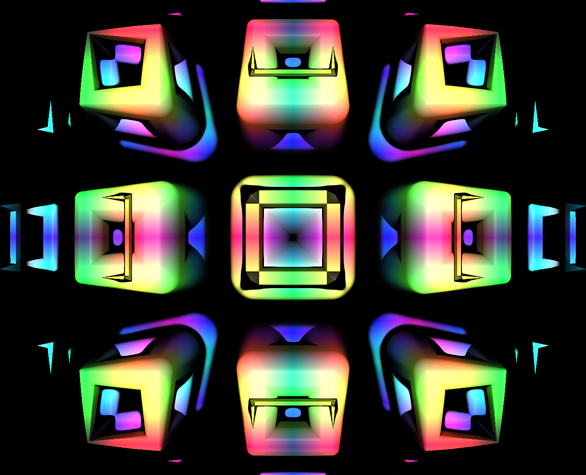

# AutoSDF

procedurally generated signed distance functions



**this is a very GPU-intensive application. if it's running slow, be sure to reduce `scale`, `sdf-length` and/or `color-length` in `settings.txt`.**
you can also reduce `max-iterations` and increase `distance-threshold` if it's still slow.

## controls

- move mouse to look around
- W,A,S,D/arrow keys to move forward/backwards/left/right + Q,E/PageUp,PageDown to move up/down
- R to create a new SDF - use this a lot! most SDFs are boring!
- Space to "unpause time" (start animating).
  Press space again to pause time, and shift+space to rewind time.
- [ and ] to go forwards and backwards in time
- 0 to reset location + time
- =/- (equals/minus) to expand/contract the surface (change the "level set" of the SDF you're looking at)
- Ctrl+C to copy SDF to clipboard, Ctrl+V to paste SDF from clipboard. On Linux
  if you close the application the clipboard contents will be lost (thanks a lot X11).
- F to go fullscreen
- F10 to take a screenshot (will be saved to a folder called `screenshots`)
- Escape to quit
- You can use Shift to move faster and Ctrl to move slower.

## saving SDFs

if you get an SDF which looks cool, you can copy it with Ctrl+C, and save it somewhere/share it with
your friends.

also a list of all SDFs you've generated is stored in `scenes.txt`.

## cool SDFs

here are some cool SDFs i've found. take a look at them (using Ctrl+V) and especially try using minus/equals!
```
a263736466a167436f6d706f736583a1695472616e736c61746583a163463332fa3f4811e4a163463332fa3f78c51ea16454696d6582fa3d90de6dfa3f596b98a1634d697883a167436f6d706f736583a167436f6d706f736582684964656e74697479684964656e74697479a167436f6d706f736583684964656e74697479a166537068657265a163463332fa3eef3a44684964656e74697479684964656e74697479a167436f6d706f736583a16f496e66696e6974654d6972726f7273a163463332fa3f6ad464a165546f727573a266726164697573a163463332fa3fcd633269746869636b6e657373a163463332fa3d887747684964656e74697479a16454696d6582fabcad7e74fa3f444f5c684964656e746974796e636f6c6f725f66756e6374696f6ea167436f6d706f736582a167436f6d706f736582a167436f6d706f736582a166526f7461746583a163463332fa3f139110a163463332fa3e8c6384a163463332fa3edc7998675369676d6f6964a16353696ea16454696d6582fa3ce10f8cfa3e42f2c8a167436f6d706f736582a16f496e66696e6974654d6972726f7273a163463332fa3f4e41c8a167436f6d706f736582a16641726374616ea16454696d6582fa3dc7acedfa3f76784ca16353696ea163463332fa3f62c45a
a263736466a167436f6d706f736583a166526f7461746583a163463332fa3f76cab2a163463332fa3d81cad0a163463332fa3f76ebd4a1634d696e82a167436f6d706f736583675369676d6f6964a1634d696e82a1634d697883a167436f6d706f736583684964656e74697479a166537068657265a163463332fa3e5a3e68684964656e74697479a167436f6d706f736583684964656e74697479a166537068657265a163463332fa3f46ade4684964656e74697479a163463332fa3f551da4a1634d696e82a167436f6d706f736583684964656e74697479a166537068657265a163463332fa3f306be8684964656e74697479a167436f6d706f736583684964656e74697479a166537068657265a163463332fa3ca99ac0684964656e74697479684964656e74697479a167436f6d706f736583a16f496e66696e6974654d6972726f7273a163463332fa3e9febeca167436f6d706f736583a16f496e66696e6974654d6972726f7273a163463332fa3ee05424a167436f6d706f736583675369676d6f6964a1634d696e82a166537068657265a163463332fa3e16dcf0a166537068657265a163463332fa3f48f0dc684964656e74697479684964656e74697479684964656e74697479684964656e746974796e636f6c6f725f66756e6374696f6ea167436f6d706f736582a16353696ea163463332fa3f1c2a8e675369676d6f6964
a263736466a1634d696e82a1634d696e82a166537068657265a163463332fa3f2365aca1634d697883a167436f6d706f736583a16641726374616ea163463332fa3eb04a5ca167436f6d706f736583675369676d6f6964a169536d6f6f74684d696e82a167436f6d706f736583684964656e74697479a166537068657265a163463332fa3eeb25b8684964656e74697479a167436f6d706f736583684964656e74697479a166537068657265a163463332fa3f10d6a2684964656e74697479684964656e74697479684964656e74697479a165546f727573a266726164697573a163463332fa3d9099f069746869636b6e657373a163463332fa3e00b102a163463332fa3f06b5a2a1634d696e82a165546f727573a266726164697573a163463332fa40121b0169746869636b6e657373a163463332fa3e32f4faa1634d697883a16443756265a163463332fa3f7f9dc8a1634d697883a165546f727573a266726164697573a163463332fa3f9286e369746869636b6e657373a163463332fa3d8a3f27a167436f6d706f736583a167436f6d706f736582a167436f6d706f736582684964656e74697479684964656e74697479a16f496e66696e6974654d6972726f7273a163463332fa3ea62688a168426f784672616d65a26473697a65a163463332fa3fc0fb4969746869636b6e657373a163463332fa3e472462684964656e74697479a163463332fa3f69a73ea163463332fa3f5b9c9e6e636f6c6f725f66756e6374696f6ea16f496e66696e6974654d6972726f7273a163463332fa3ef4ea8c
a263736466a169536d6f6f74684d696e82a1634d696e82a167436f6d706f736583a167436f6d706f736582a16641726374616ea163463332fa3e6d7230a1695472616e736c61746583a163463332fa3e7262f8a163463332fa3eece0eca163463332fa3f49c42ca168426f784672616d65a26473697a65a163463332fa3ff3ee1169746869636b6e657373a163463332fa3df6dfed684964656e74697479a167436f6d706f736583a16f496e66696e6974654d6972726f7273a163463332fa3f2a2de8a165546f727573a266726164697573a163463332fa3fc93f1e69746869636b6e657373a163463332fa3e0fa700684964656e74697479a169536d6f6f74684d696e82a169536d6f6f74684d696e82a1634d696e82a169536d6f6f74684d696e82a167436f6d706f736583675369676d6f6964a1634d696e82a166537068657265a163463332fa3e0586b0a166537068657265a163463332fa3f4d6214684964656e74697479a167436f6d706f736583a167436f6d706f736582684964656e74697479684964656e74697479a1634d697883a166537068657265a163463332fa3f5c46e6a166537068657265a163463332fa3f3f4896a163463332fa3f10ba30684964656e74697479a166537068657265a163463332fa3ef3b604a167436f6d706f736583a165537153696ea163463332fa3ef1bfb8a1634d697883a1634d697883a168426f784672616d65a26473697a65a163463332fa3ee4801069746869636b6e657373a163463332fa3dc84d37a168426f784672616d65a26473697a65a163463332fa4019d5d269746869636b6e657373a163463332fa3d5d0307a163463332fa3eb7554ca167436f6d706f736583a165537153696ea163463332fa3f31c33ca167436f6d706f736583684964656e74697479a166537068657265a163463332fa3e7db3c0684964656e74697479684964656e74697479a163463332fa3f3176c0684964656e74697479a165546f727573a266726164697573a163463332fa3f253f0c69746869636b6e657373a163463332fa3c96c48d6e636f6c6f725f66756e6374696f6ea16f496e66696e6974654d6972726f7273a163463332fa3ea219f4
```
